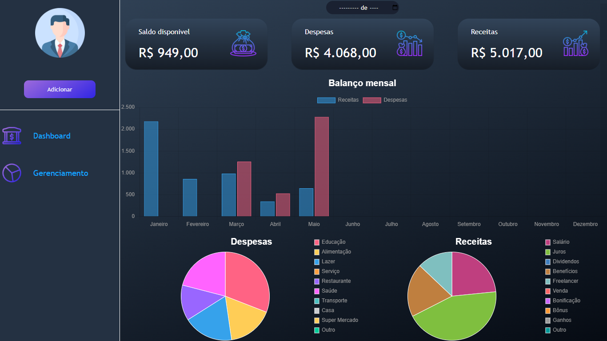

<h1 align="center"> Personal finances </h1>

  <a href="#-projeto">Projeto</a>&nbsp;&nbsp;&nbsp;|&nbsp;&nbsp;&nbsp;
  <a href="#-tecnologias">Tecnologias</a>&nbsp;&nbsp;&nbsp;|&nbsp;&nbsp;&nbsp;
  <a href="#-licença">Licença</a>

  

 

        

## 💻 Projeto

**Personal finances** é uma aplicação de gerenciamento de finanças pessoais onde você pode gerenciar e monitorar seus gastos e ganhos durante o ano

- [Confira o projeto online](https://edsonyuri.github.io/Personal-finances/)

## 🚀 Tecnologias

Esse projeto foi desenvolvido com as seguintes tecnologias:

- HTML e CSS
- JavaScript
- Git e Github
- [Chart.js](https://www.chartjs.org)

## 🧾 Licença
Esse projeto está sob a licença MIT.

